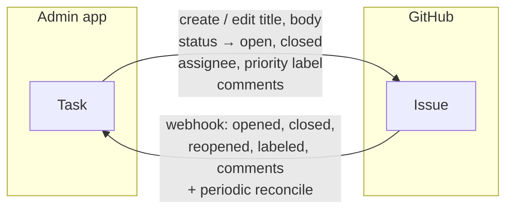
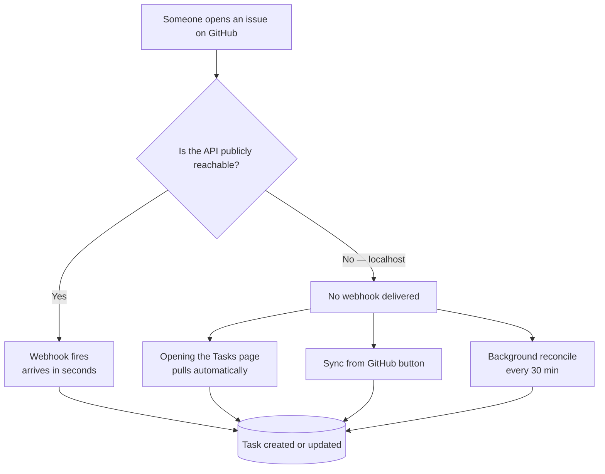

# Setup Guide — Task Manager & GitHub Integration

This release adds a task manager to the admin app and two-way synchronisation
with GitHub Issues. It also fixes several pre-existing bugs that prevented the
app from starting or logging in.

**If you are pulling this branch, you must run the steps in
[What you have to do](#what-you-have-to-do) — the app will not start otherwise.**

---

## Contents

- [What's new](#whats-new)
- [What you have to do](#what-you-have-to-do)
- [How the GitHub sync works](#how-the-github-sync-works)
- [Connecting a repository](#connecting-a-repository)
- [Test accounts](#test-accounts)
- [Bugs fixed in this release](#bugs-fixed-in-this-release)
- [Troubleshooting](#troubleshooting)
- [API reference](#api-reference)

---

## What's new

A **Tasks** section for all three roles, plus GitHub Issue sync.

| Role | Path | Can do |
|------|------|--------|
| Tenant Admin | `/super/tasks`, `/super/github-repos` | Everything: create, assign, delete, connect repos, map GitHub usernames |
| Org Admin | `/org/tasks` | Create, assign, delete, comment, trigger a sync |
| Employee | `/emp/tasks` | See only their own tasks; change status and comment |

Tasks and GitHub Issues stay in step in both directions.



---

## What you have to do

### 1. Install the new dependencies

Two packages were added: `httpx` (GitHub API calls) and `cryptography`
(encrypting stored tokens).

```bash
# Windows PowerShell
.\.venv\Scripts\Activate.ps1
pip install -r requirements.txt

# macOS / Linux
source .venv/bin/activate
pip install -r requirements.txt
```

> **Note for Python 3.12 users:** `asyncpg` was pinned at `0.28.0`, which has no
> prebuilt wheel for 3.12 and fails to compile without a C toolchain. It is now
> pinned at `0.30.0`. If you previously worked around this, you can undo that.

### 2. Add the new environment variables

Three new keys in `.env`. Copy `.env.example` if you don't have a `.env` yet.

```ini
# JWT signing key — REQUIRED.
# Previously hardcoded in source; now read from here.
JWT_SECRET_KEY=

# Encrypts GitHub tokens at rest. Required to connect any repository.
GITHUB_ENC_KEY=

# Minutes between background reconcile passes (0 disables). Optional.
GITHUB_SYNC_INTERVAL_MINUTES=30
```

Generate the two secrets:

```bash
# JWT_SECRET_KEY
python -c "import secrets; print(secrets.token_urlsafe(64))"

# GITHUB_ENC_KEY
python -c "from cryptography.fernet import Fernet; print(Fernet.generate_key().decode())"
```

**Both are per-environment secrets. Do not commit them and do not share one
between dev and production.**

- Changing `JWT_SECRET_KEY` logs everyone out — they simply sign in again.
- Changing `GITHUB_ENC_KEY` makes stored GitHub tokens **unreadable**. Each
  repository's token has to be entered again. Set it once and leave it alone.

If `JWT_SECRET_KEY` is blank the server generates a random key per process and
logs a CRITICAL warning. That is safe but logs everyone out on each restart, and
each worker signs differently — so set it.

### 3. Run the migrations

```bash
alembic upgrade head
```

Four migrations run, in this order:

| Revision | What it does |
|----------|--------------|
| `b1c2d3e4f5a6` | **Reconciles pre-existing schema drift** — see the warning below |
| `a1b2c3d4e5f6` | Creates `tasks`, `task_comments`, `github_repos` |
| `c2d3e4f5a6b7` | Adds `users.github_username`, `task_comments.github_comment_id` |
| `d3e4f5a6b7c8` | Adds `github_repos.is_default`, `github_repos.default_assignee_id` |

> ### ⚠️ Read this before migrating a database with real data
>
> The migration chain had fallen a long way behind `app/models/domain.py`. It
> only ever created **5 tables** (`tenants`, `users`, `devices`,
> `attendance_logs`, `commands`), while the models define **11**. `departments`,
> `holidays`, `leaves`, `notifications`, `settings` and `refresh_tokens` had no
> migration at all, and `users` was migrated with 4 of its 11 columns. Schema was
> evidently being created some other way (see `scratch/sync_db.py`).
>
> `b1c2d3e4f5a6` fixes this by **inspecting the live database** and creating only
> what is missing. It is safe to run against a database that already has those
> tables — it skips anything present. It also relaxes `NOT NULL` on columns the
> models declare optional (notably `users.finger_id`, which otherwise makes it
> impossible to create an employee who has not enrolled a fingerprint).
>
> It is deliberately **not reversible**. Take a backup first:
>
> ```bash
> pg_dump -U <user> -d <database> > backup-before-tasks.sql
> ```

### 4. Rebuild the frontend

No new npm packages, but the bundle must be rebuilt.

```bash
cd frontend-react
npm install
npm run dev      # or: npm run build
```

### 5. Start it

```bash
# Terminal 1 — backend
alembic upgrade head
uvicorn app.main:app --reload --port 8000

# Terminal 2 — frontend
cd frontend-react && npm run dev
```

Everyone is logged out on first start because the JWT key moved into `.env`.
Sign in again.

---

## How the GitHub sync works

Issues reach the app by three routes, so it keeps working whether or not your
server is reachable from the internet.



**On localhost you will not get webhooks** — GitHub cannot reach `127.0.0.1`.
The Tasks page pulls automatically when it opens, and the **Sync from GitHub**
button pulls on demand, so nothing is lost. For instant delivery during
development, expose the port:

```bash
cloudflared tunnel --url http://localhost:8000
# or: ngrok http 8000
```

Then use the HTTPS address it prints as the webhook Payload URL.

### What syncs, in which direction

| Change | Direction | Notes |
|--------|-----------|-------|
| Issue opened on GitHub | GitHub → app | Becomes a task with `source: github` |
| Issue closed / reopened | GitHub → app | Task status becomes Done / To Do |
| Labels `P0`, `urgent`, `high`, `low` | GitHub → app | Mapped to task priority |
| Comment on the issue | GitHub → app | Shown as `username (GitHub)` |
| Task created in the app | app → GitHub | Opens a real issue (opt-in per task) |
| Title / description edited | app → GitHub | Patches the issue |
| Task marked Done | app → GitHub | Closes the issue |
| Assignee changed | app → GitHub | Needs the GitHub username mapping |
| Priority changed | app → GitHub | Sets a `priority:high` label |
| Comment added in the app | app → GitHub | Posted with the author's name prefixed |
| Task **deleted** | ✗ nothing | Deletion is never mirrored |

Re-syncing never overwrites your local assignee, due date or department — those
belong to the app. Only title, description, labels and open/closed state come
from GitHub.

---

## Connecting a repository

### Step 1 — Create a GitHub token

Open **https://github.com/settings/personal-access-tokens/new**

- **Repository access** → Only select repositories → pick your repo
- **Permissions** → Repository permissions → **Issues: Read and write**
  (Metadata: Read-only is added automatically — leave it)
- Generate, then copy the token. GitHub shows it once.

A classic token works too: **https://github.com/settings/tokens/new** with the
`repo` scope.

> 📷 *Screenshot to add: `docs/images/01-github-token.png` — the fine-grained
> token permissions screen with Issues set to Read and write.*

### Step 2 — Connect it in the app

Sign in as **Tenant Admin** → **Tasks** → **Connect GitHub**.

Enter the repository as `owner/repo`, paste the token, and tick **Make this the
default** if you want every new task to open an issue there.

> 📷 *Screenshot to add: `docs/images/02-connect-github.png` — the Connect
> GitHub panel on the Tasks page.*

The server verifies the repo with GitHub before saving, imports existing issues,
and shows a **webhook secret once**. Copy it if you plan to set up webhooks.

### Step 3 — Map GitHub usernames (optional)

**GitHub Repos** page → *GitHub usernames* table at the bottom.

GitHub cannot resolve `employee@yourcompany.com` to a GitHub user, so assignment
only mirrors onto issues for people whose GitHub login is entered here. People
without one still receive the task; the issue is left unassigned.

> 📷 *Screenshot to add: `docs/images/03-username-mapping.png` — the GitHub
> usernames table.*

### Step 4 — Webhooks (optional, needs a public URL)

In the repo: **Settings → Webhooks → Add webhook**

| Field | Value |
|-------|-------|
| Payload URL | `https://your-api-domain/api/webhooks/github` |
| Content type | `application/json` |
| Secret | the secret shown when you connected the repo |
| Events | *Let me select individual events* → **Issues** and **Issue comments** |

> 📷 *Screenshot to add: `docs/images/04-webhook.png` — the GitHub webhook form
> filled in.*

Every webhook request is verified with an HMAC-SHA256 signature. Requests
without a valid signature are rejected with 401.

---

## Test accounts

```bash
python seed_test_accounts.py
```

Creates a tenant, an Engineering department, 1 org admin, 5 employees and 12
sample tasks. Safe to re-run — it resets passwords and leaves tasks alone.

| Role | Login page | Username | Password |
|------|-----------|----------|----------|
| Tenant Admin | `/login/tenant` | *(none)* | API key `test-tenant-key-0000000000000000` |
| Org Admin | `/login/org` | `orgadmin@test.local` | `OrgAdmin@123` |
| Employee | `/login/employee` | `employee@test.local` … `employee5@test.local`, or `EMP001`–`EMP005` | `Employee@123` |

Tenant Admin has **no password** — that role authenticates by API key only.

The script refuses to run unless `DATABASE_URL` points at localhost. These are
development credentials; never run it against production.

---

## Bugs fixed in this release

These were pre-existing and are unrelated to the task manager, but they blocked
startup or login.

| Bug | Symptom | Fix |
|-----|---------|-----|
| Frontend called `/api/org-admin/*` and `/api/superadmin/*` | **Every org-admin call returned 404**, starting with the dashboard on login | Repointed to `/api/org` and `/api/super`, which is what the backend serves |
| Employee leave/holiday/notification routers mounted flat | All collapsed onto `/api/employee`; `/{id}/read` and `/{leave_id}/cancel` shadowed each other | Mounted with their own sub-prefixes |
| `/api/auth/tenant-login` did not exist | Tenant admin login always failed | Endpoint added |
| `SECRET_KEY` hardcoded in `app/core/security.py` | Anyone with the source could forge a token for any user | Moved to `JWT_SECRET_KEY` in `.env` |
| `asyncpg==0.28.0` | `pip install` failed on Python 3.12 without a C compiler | Bumped to `0.30.0` |
| `requirements.txt` missing `python-jose`, `passlib`, `bcrypt`, `python-multipart`, `email-validator` | App installed, then crashed on import | Added |
| `due_date` typed as `datetime` | Creating a task with a due date returned 422 | Accepts a plain `YYYY-MM-DD` |
| `api.js` did `new Error(error.detail)` | Every validation error displayed as `[object Object]` | Renders FastAPI's error list as readable text |
| Credentials hardcoded in `docker-compose.yml` | DB and MQTT passwords committed to the repo | Moved to `env_file` |
| No `.dockerignore` | `.env` was copied into image layers | Added to both backends |

> **If this repo was ever public, or has been cloned or forked:** the Postgres
> and MQTT passwords that were in `docker-compose.yml` are still in the git
> history. Removing them from the file does not remove them from history.
> Rotate those credentials.

---

## Troubleshooting

**`relation "departments" does not exist` during migration**
Run `alembic upgrade head` again from the start. `b1c2d3e4f5a6` must run before
`a1b2c3d4e5f6`; that ordering is enforced by the chain, so this usually means an
earlier migration failed. Check `alembic current`.

**`Connect call failed ('127.0.0.1', 5432)`**
Postgres isn't running. `docker start pg`, or check your `DATABASE_URL` host —
`172.17.0.1` is a Linux Docker bridge address and does not resolve on Windows or
macOS. Use `localhost` when running the app outside a container.

**Repo card shows `READ-ONLY token`**
The token lacks write access. Regenerate it with **Issues: Read and write** and
re-enter it. Tasks still import; pushes will fail with a clear message.
(Quirk: on a *public* repo a read-only token can still create issues, because
GitHub does not gate an action anyone could perform anyway.)

**Issues created on GitHub don't appear**
On localhost that is expected — there is no webhook. Press **Sync from GitHub**,
or open the Tasks page, which pulls automatically. If it still doesn't work,
check the repo card on **GitHub Repos** for a last sync error.

**Tasks aren't reaching GitHub**
Check the destination in the GitHub bar at the top of the Tasks page. If it
reads *Keep local only*, nothing is sent. Pick a repository, or set one as the
default.

**`GITHUB_ENC_KEY is not set`**
Add it to `.env` and restart. Without it, tokens cannot be stored securely, so
connecting a repository is refused rather than storing a token in plaintext.

**Devices / Settings / Activity pages fail**
Those screens call endpoints that were never implemented on the backend
(`/api/org/devices`, `/api/org/settings`, `/api/org/activity` and about 20
others). Unrelated to this release; they have never worked.

---

## API reference

### Tenant Admin — `X-API-Key` header

| Method | Path | Purpose |
|--------|------|---------|
| GET | `/api/tenant/tasks` | List, with `status` `priority` `source` `assigned_to` `dept_id` `search` filters |
| POST | `/api/tenant/tasks` | Create. `github_repo_id` targets a repo, `keep_local: true` opts out of the default |
| PUT | `/api/tenant/tasks/{id}` | Update; changes propagate to the linked issue |
| DELETE | `/api/tenant/tasks/{id}` | Delete. Refused for GitHub-sourced tasks |
| POST | `/api/tenant/tasks/{id}/push` | Open an issue for an existing local task |
| GET/POST | `/api/tenant/tasks/{id}/comments` | Read / add comments |
| GET | `/api/tenant/tasks/stats` | Counts per status |
| GET | `/api/tenant/tasks/assignable-users` | Users who can hold a task |
| GET/POST | `/api/tenant/github/repos` | List / connect repositories |
| PUT/DELETE | `/api/tenant/github/repos/{id}` | Update (default, assignee, token) / remove |
| POST | `/api/tenant/github/repos/{id}/sync` | Sync one repository |
| POST | `/api/tenant/github/sync` | Sync every active repository |
| GET | `/api/tenant/github/repos/{id}/write-access` | Does the token allow writes? |
| GET/PUT | `/api/tenant/github/user-mapping` | GitHub username per user |

### Org Admin — JWT

Same task endpoints under `/api/org/tasks`, plus:

| Method | Path | Purpose |
|--------|------|---------|
| GET | `/api/org/tasks/github-repos` | Repos available to push to (id and name only) |
| POST | `/api/org/tasks/github-sync` | Trigger a sync — read-only, no token access |

### Employee — JWT

| Method | Path | Purpose |
|--------|------|---------|
| GET | `/api/employee/tasks` | Only tasks assigned to them |
| GET | `/api/employee/tasks/stats` | Their own counts |
| PATCH | `/api/employee/tasks/{id}/status` | Change status — the only field they may edit |
| GET/POST | `/api/employee/tasks/{id}/comments` | Read / add comments |

### Webhook — unauthenticated, HMAC-verified

| Method | Path | Purpose |
|--------|------|---------|
| POST | `/api/webhooks/github` | Receives `issues` and `issue_comment` events |

The only unauthenticated endpoint in the app. Every request must carry a valid
`X-Hub-Signature-256` matching the repository's stored secret, compared with
`hmac.compare_digest`.

---

## Notes for reviewers

A few decisions worth knowing about:

**GitHub writes never roll back a local save.** The task is committed first, then
pushed. A revoked token or a GitHub outage produces a `github_warning` field in
the response and the task still exists locally.

**Webhook echo is prevented by id, not by content.** When the app posts a comment
it stores the id GitHub returns; the inbound webhook for that same comment is
recognised and skipped. Creating an issue writes the issue number onto the task
immediately, so the `issues.opened` webhook it triggers updates that task rather
than creating a second one. There is also a guard for the case where the webhook
lands *before* the number is written.

**Priority labels merge rather than replace.** GitHub's PATCH overwrites the
whole label array, so sending only `priority:high` would delete every other
label. Existing labels are preserved and only the previous `priority:*` is
swapped.

**Tokens are encrypted with Fernet and never returned by the API.** The repo
list exposes `has_token: true/false`, never the value.
